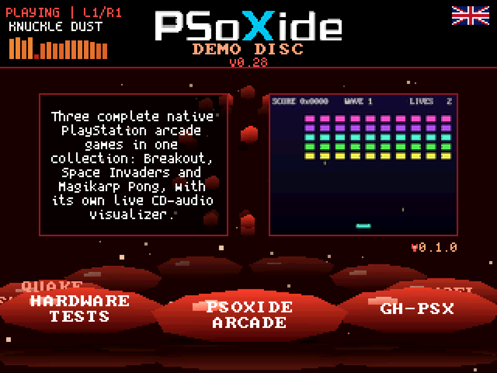
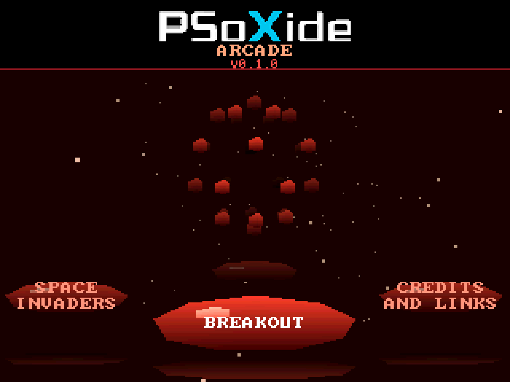
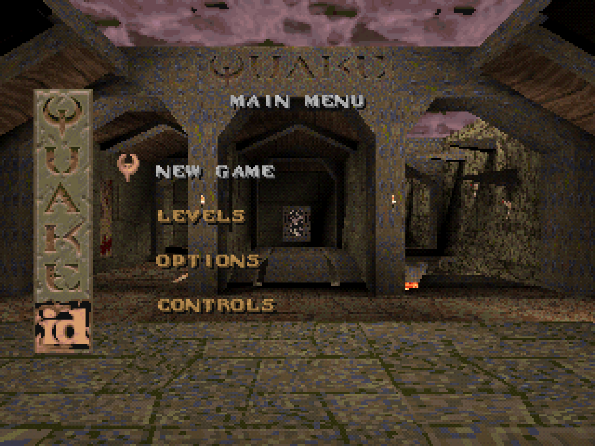
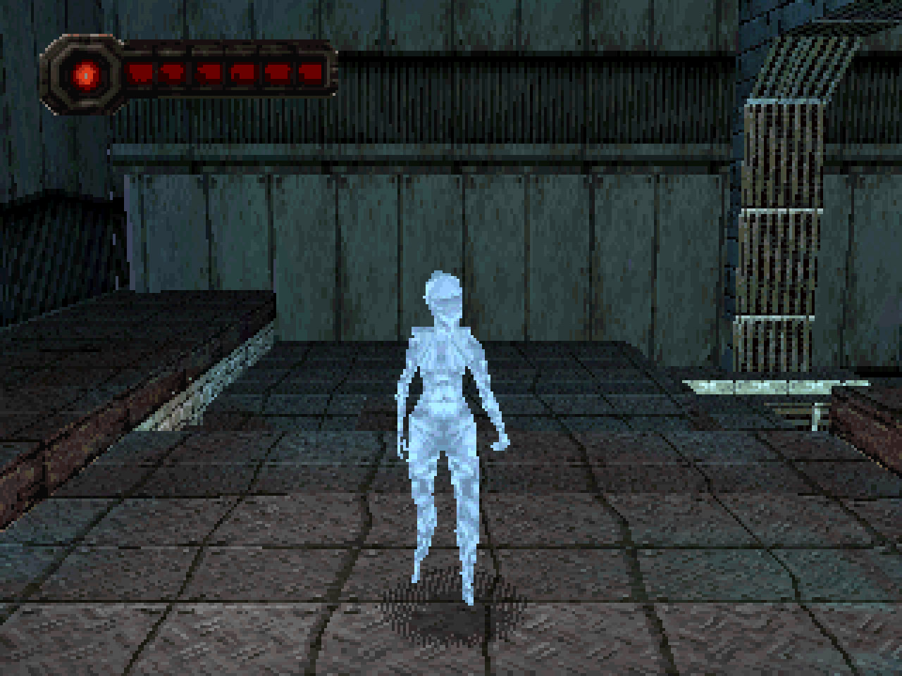

# PSoXide demo disc

One CD-R that boots on a real PlayStation into a menu, and chain-loads any of
the PSoXide programs burned alongside it.

| Demo Disc outer carousel | PSoXide Arcade selector |
| --- | --- |
| [](assets/readme/v028-carousel.png) | [](assets/readme/arcade-selector.png) |

| Quake chain-loaded from the combined disc | Current Cortex Ignition project |
| --- | --- |
| [](assets/readme/quake-chainloaded.png) | [](assets/readme/cortex-current.png) |

```bash
make disc      # -> "PSoXide Demo Disc.{bin,cue}" in the PSoXide game library
make check     # host tests, including the Quake pin check
```

## Public release

The owner approved public non-commercial distribution of the standard pressing
with the canonical Quake 1.06 shareware payload on 2026-08-25. `make itch`
publishes its flat BIN/CUE download, while `make release-web` updates the split
disc delivery consumed by the browser emulator. Both commands reject `HL=1`;
the Half-Life pressing is never sent to either public destination.

The current public destinations are
[itch.io](https://bonnie-studios.itch.io/psoxide-demo-disc) and the
[browser emulator](https://bonnie-studios.itch.io/psoxide).

## How it boots

The BIOS reads `SYSTEM.CNF`, loads `PSX.EXE` (the launcher), and runs it. The
launcher reads `DEMOTOC.BIN` at a fixed LBA to find out what is on the disc,
draws the menu, and on selection streams the chosen program off the disc and
jumps to it.

That last step needs one trick. Every PSoXide program links to `0x80010000`
(`sdk/psoxide.ld`), including the launcher, so the launcher cannot load a game
itself: it would overwrite its own code halfway through the copy. The `loader`
crate is therefore built separately, linked at `0x801F0000`, and embedded in
the launcher as raw bytes. The launcher copies it above every game's payload,
flushes the instruction cache, and jumps. From there nothing below
`0x801F0000` is live, so the game can land wherever it wants.

`mkdisc` refuses to build a disc containing a program whose payload would
reach `0x801F0000`, so that constraint fails the build rather than the console.

## Layout

| Piece | What it is |
| --- | --- |
| `loader/` | the chain-load blob, its own linker script, no `psx-rt` |
| `launcher/` | the menu, a normal PSoXide program |
| `carousel/` | where the ring and the ball of balls land on screen, host-testable |
| `disc-toc/` | the on-disc table format, shared by `mkdisc` and the launcher |
| `tools/mkdisc/` | host disc builder, on top of PSoXide's `psx-iso` |
| `games/` | the source repos, as submodules |

## Sharing a disc

A program built for its own disc has that disc's geometry baked in: pack LBAs
cooked at 1024, CD-DA tracks numbered from 2. `mkdisc` does not re-cook
anything. It drops each game's *existing* disc image onto the big one verbatim
and records two numbers: how far the image moved, and how many CD-DA tracks sit
ahead of it. The loader passes those to the game's `_start`, and
`psx_io::disc_base` applies them inside the three places the SDK addresses the
disc. Both default to zero, so the same binary boots standalone unchanged.

Relocated sectors get their BCD MSF header rewritten so the drive's seeks land.
That is safe in place: Mode 2 Form 1 ECC is computed with those bytes zeroed.

## What is on it

The current layout has nine outer programs on the default pressing, and
Half-Life adds a tenth. PSoXide Arcade is one of those programs and
contains three games of its own. Automated evidence is recorded per program
and must not be read as an
original hardware claim. The current default disc is 99450 sectors (22:06:00,
223.1 MiB, 8 CD-DA tracks); the Half-Life pressing is 303989 sectors
(67:33:14, 681.9 MiB, 35 CD-DA tracks), which is 84% of an 80-minute CD-R.

| Program | How it ships |
| --- | --- |
| Cortex Ignition | current PXBSP project as a whole image, 1 CD-DA track |
| Half-Life | whole image, 27 CD-DA tracks, `HL=1` only |
| Voxide | whole image, WORLD.PAK assets |
| NitroXide | whole image, WORLD.PAK arena atlas |
| Celeste Classic Collection | bare EXE |
| PSXcel | bare EXE |
| GH-PSX | whole image without duplicated CD-DA; borrows Arcade's track |
| PSoXide Arcade | whole collection image: Breakout, Space Invaders and Magikarp Pong; owns 1 CD-DA track |
| Hardware Tests | whole image, 1 CD-DA track |
| Quake shareware | whole image, no CD-DA track |

Celeste and PSXcel never read the disc after boot, so they ride as bare EXEs
and do not care which SDK built them: a `_start` that ignores the loader's
arguments is still a correct `_start`. Voxide and NitroXide load `WORLD.PAK`
at startup, so their complete images ride the same relocation path as the
larger streaming games.

`CORTEX IGNITION` is the active new-engine entry. It comes from the exact
`editor/projects/default` project named `Cortex Ignition Tech Demo 0.1` at the dedicated
PSoXide pin recorded in the Makefile. The standard, publication-shaped pressing
keeps this unfinished entry behind the Konami unlock. The private Half-Life
pressing exposes it for direct testing. `QUAKE SHAREWARE` is the last program before
CREDITS, and a default program rather than a variant. Quake streams `WORLD.PAK`,
so a bare executable is not sufficient; the entry uses the same caller-provided
LBA offset that relocates
Voxide, NitroXide, and the other streaming programs. Its payload is pinned by
revision and by four artifact hashes, and `disc-only` refuses to lay out a
sector until they check. See [the Quake runbook](docs/quake-shareware.md).

After unlocking, the standard order is Cortex Ignition, Voxide, NitroXide,
Celeste Collection, PSXcel, GH-PSX, PSoXide Arcade,
Hardware Tests, Quake Shareware, then Credits. PSoXide Arcade opens a dedicated
cabinet selector for Breakout, Space Invaders and Magikarp Pong. The Half-Life
pressing inserts Half-Life directly after Cortex Ignition.

## The menu

A carousel of glossy blue pills under a turning ball of balls, over a
starfield: the PlayStation demo discs, as closely as flat and gouraud
triangles get you. Left and right spin the ring, X runs the pill at the front, up or down swaps
the description between English and Italian under a drawn flag, and L1 or R1
skips the music. Titles too long for a pill break across two lines.

Top left is a music panel: what is playing, a sixteen-band level meter, and the L1/R1
label. The meter is not keeping time, it is listening: `mkdisc` runs an FFT
over each track at disc-build time and ships the result in a `SPECTRUM.BIN`
region the launcher reads at boot. Bands are normalised per band rather than
globally, because a drum and bass track has so much more energy at 60 Hz than
at 12 kHz that a single scale leaves the top half of the meter permanently
flat. Only that control is labelled on screen. The rest a PlayStation owner
tries without being told; nothing about the screen suggests the shoulder
buttons do anything at all.

Track titles come off the disc like everything else the menu shows, so the
launcher still knows nothing about what it is playing until it reads the
table. That table now spans two sectors, since the titles and two
descriptions per program stopped fitting in one.

The whole scene answers the music. `tools/beatgrid.py` fits a tempo and phase
to each track's onset envelope offline and the numbers ship in the disc table,
so the grid stays in step for the length of a track rather than drifting out of
it. On that grid: the ball blows outward on every beat and snaps back, harder
on the downbeat; the pills flash on the downbeat only; the starfield twinkles
on the offbeat, in the gaps the other two leave; and the ball's idle spin rides
the bar, quickest just after the downbeat.

It answers the pad too. Browsing shoves the ball's spin, which coasts back down
over the next second, and the same shove blows the beads apart and lets them
re-form. The starfield drifts with it, brighter stars faster.

A shaft of light crosses the frame behind everything, drawn additively so it
brightens what it passes rather than covering it, and the carousel is mirrored
in the floor below it.

Choosing a program is an event rather than a cut: the camera accelerates into
the starfield until the stars streak into lines, the ball blows itself apart
past the edges of the screen, and only then does the fade hand over to the
chain-load. The high-RAM loader then keeps a standalone copy of the spinning
globe and starfield visible over the progress bar while the selected program
overwrites the launcher. A tail brighter than its head marks a star that
wrapped back to the far plane between two frames, which is what keeps a streak
from crossing the whole sky.

None of it uses a texture or a float. Ellipses are triangle fans whose segment
count follows their size: at a flat twelve the ball alone put the frame over
2000 triangles and the menu stopped holding 60 Hz, which stretched every
time-driven effect with it.

No textures and no floating point. Ellipses are twelve-segment triangle fans
shaded top to bottom; the ring and the sphere are one perspective divide each,
depth-sorted back to front.

## Status

The combined-disc structural and Quake gates are verified headlessly. The
Quake gate uses the frontend's embedded-playtest path: the first executable
boot is HLE, while the launcher still reads the pressed table and chain-loads
the relocated guest from the built `.cue`. This is emulator evidence, not a
real-BIOS or original-console claim:

- the locked standard carousel contains nine visible entries including
  Credits; the unlock reveals the current Cortex Ignition entry
- `hello-pack` streams its pack and reports ALL PASS with its image relocated
  220 sectors in, and still reports ALL PASS standalone (`make relocation-check`)
- two CD-DA discs on one image play 440 Hz and 1000 Hz respectively, so the
  second one's track base shifted it off track 2
- PSoXide Arcade owns the Goncharov CD-DA track by
  [magikAAAAArp](https://www.youtube.com/@magikAAAAArp/videos), used with the
  band's permission; both Magikarp Pong and GH-PSX relocate to that one
  physical copy on the combined disc

## Building

`make disc` writes into PSoXide's game library, so the disc shows up in the
emulator next to everything else. The release files are flat in that directory:

```
~/Downloads/ps1 games/PSoXide Demo Disc.{bin,cue}
```

Override with `DIST=...` for somewhere else, or `PSOXIDE_LIB=...` for a
different library. `PROGRAMS_PSOXIDE=/absolute/path/to/PSoXide` selects the
checkout used for every ordinary rebuilt program. `PSOXIDE` remains the exact
checkout named by Quake's artifact provenance, so advancing the shared runtime
cannot silently change the SDK contract of the pinned Quake image. The Cortex
project is staged from `games/PSoXide-cortex-current` under `build/`, keeping
generated output outside the pinned PSoXide worktree. `games/psoxide-arcade`
is the private collection repository
and the canonical owner of `goncharov.cdda` by
[magikAAAAArp](https://www.youtube.com/@magikAAAAArp/videos), used with the
band's permission; the combined-disc GH-PSX image is built data-only and
borrows Arcade's relocated track instead of carrying a second copy.

Two pressings exist. `make disc` builds the default one; `make disc HL=1`
builds the same disc plus Half-Life, for show-floor demos, under a different
name so the two bins cannot be confused. Both carry Quake shareware. The
`games/hl-psx` and `games/psoxide-arcade` are private until their own releases,
so a fresh clone needs access to Arcade even for the default pressing. The
Half-Life pressing additionally requires access to HL-PSX.

`make disc` needs the pinned Quake tree beside this one (`QUAKE_SRC`, the
sibling `quake-psx` checkout by default) and will not build without
it. `make quake-headless-check` is the gate to run before a burn: it chain-
loads Quake off the built disc twice and requires the two replays to agree.

## Repinning Quake

Six values in the Makefile and one submodule pointer are the whole Quake
contract. They all come out of a built Quake tree, and `make quake-repin`
measures them:

```bash
make quake-repin                          # from the default QUAKE_SRC
make quake-repin QUAKE_SRC=/path/to/tree  # from somewhere else
```

It prints, and writes nothing:

```
QUAKE_EXPECTED_REV ?= <the Quake tree's HEAD>
QUAKE_EXPECTED_PSOXIDE_REV ?= <the PSOXIDE_REV that tree declares>
QUAKE_EXPECTED_PROVENANCE_SHA256 ?= <dist/quake-psx.provenance.json>
QUAKE_EXPECTED_CUE_SHA256 ?= <dist/quake-psx.cue>
QUAKE_EXPECTED_BIN_SHA256 ?= <dist/quake-psx.bin>
QUAKE_EXPECTED_EXE_SHA256 ?= <dist/quake-psx.exe>
```

Paste those six lines over the ones near the top of the `Makefile`, then:

1. `git -C games/PSoXide checkout <QUAKE_EXPECTED_PSOXIDE_REV> && git add
   games/PSoXide` -- the Quake tree names the SDK it was built against, and
   the disc has to be on that same revision or `quake-verify` refuses.
2. Update `games/PSoXide-runtime` and `PROGRAMS_EXPECTED_PSOXIDE_REV` together
   when the ordinary programs advance. The verifier requires that clean exact
   checkout and its build stamp independently of Quake's frozen SDK.
3. `make disc` -- rebuilds every ordinary program against the shared runtime,
   re-verifies both SDK inputs and the Quake image, and writes the provenance
   receipt beside the image.
4. `make quake-headless-check` -- if `EXPECTED_VRAM_FNV` or
   `EXPECTED_DISPLAY_FNV` in `tools/check_quake_headless.py` fail, the error
   prints the values the new build produced. Those two are the only pins
   outside the Makefile. Paste them in and run it again, so a green run is
   the proof rather than the edit.

Nothing rewrites a pin on your behalf. A repin that edited its own contract
would be a verifier that agrees with whatever it is handed, and the diff is
what tells a reviewer which contract moved.

The Quake input also requires its schema-1 shipping sidecar, which binds the
clean Quake and PSoXide revisions, canonical shareware PAK, guest recipe and
toolchain, and actual cue/bin/EXE bytes. See
[the Quake runbook](docs/quake-shareware.md).
